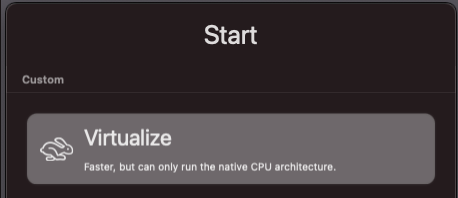
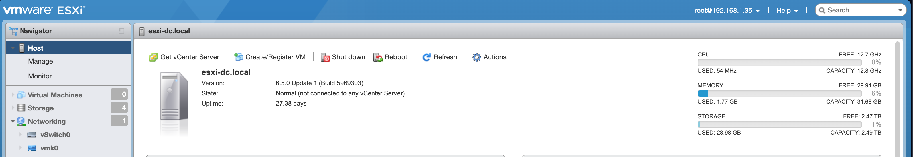
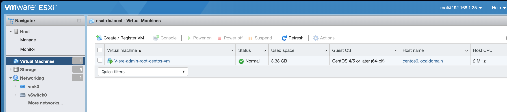

# devops_imran-teli
08/08/2023 09:23 Published

Hello [**LinkedIn**](https://www.linkedin.com) Family, I am embarking on this journey with the objective of learning and mastering [**DevOps**](https://www.youtube.com/watch?v=Xrgk023l4lI). Some of the basics skills to learn in this roadmap includes

- **Linux** (Ubuntu, Centos, RHEL)
- **Virtualization** (VirtualBox, VMware ESXi, VMware Fusion)
- **Networking**
- **Scripting**
- **DevOps Tools** (Jenkins, Ansible, Docker, Kubernetes)

### What is DevOps

Imagine that you and your classmates are engaged in a significant group project. Every team member has a role to play - someone does the research, someone does the designing, someone writes, and someone else presents. However, while working on the project, the team runs into a number of issues, including misunderstandings, delays, glitches, and changes.

There are various teams involved in software development, including the research team (developers), the design team (designers), the writing/documentation team (QA and Testing), and the presentation team (operations), much like there were in the group project.

DevOps is like a set of teamwork strategies, tools, and processes that help different groups work together better to create software that's faster, more reliable, and of higher quality.

- ⚙️ **Collaboration:** DevOps helps these teams talk to each other more. Developers talk to designers, testers also talk to developers, and everyone knows what's happening.
- ⚙️ **Speed:** With DevOps, we use tools and processes to make things faster, hence making changes quickly, and the final product gets to users faster.
- ⚙️ **Quality:** DevOps detects early mistakes in the software before it gets deployed for customers. It's like having lots of testers making sure everything works well.
- ⚙️ **Feedback:** The DevOps team releases better software products based on consumer feedback.
- ⚙️ **Automation:** Think of having a robot that can format the text perfectly so the writer doesn't need to worry. DevOps uses automation tools to do repetitive tasks, saving time and reducing errors.

08/14/2023 8:39 Published

# System Prerequisite & Setup
Using straightforward language to help everyone grasp the procedures or activities, I described what DevOps is all about in my earlier piece.
The setup of the configuration or environment will be the following topic. In my 𝗚𝗶𝘁𝗛𝘂𝗯(https://lnkd.in/gt3QBJeA) account, I've made available all the tools and account creation instructions required to finish the [DevOps]() course by Imran Teli.

# Phase 1: VMware ESXi server Machine Specification
- ASRock LGA 1200 Intel H470 SATA 6Gb/s Micro ATX Intel Motherboard
- 4 CPUs x Intel(R) Core(TM) i5-6500 CPU @ 3.20GHz
- 32 GB RAM
- HDD1: 2TB SSD
- Non-SSD: 250GB x 3
- VMware ESXi 6.5 [Installation Guide](https://vcdx133.com/2017/03/06/vsphere-6-5-basics-part-1-esxi-install/)
- Configured with Static IP address

I chose to concentrate on using Linux and MacOS as my operating systems so that I could give all of my attention to my project. Having given it some thought, I decided on [𝗖𝗲𝗻𝘁𝗼𝘀-𝟵-𝗦𝘁𝗿𝗲𝗮𝗺](https://mirrors.centos.org/mirrorlist?path=/9-stream/BaseOS/x86_64/iso/CentOS-Stream-9-latest-x86_64-dvd1.iso&redirect=1&protocol=https).

I initially intended to use VirtualBox as the host virtual machine to install Centos-9-Stream as the guest operating system, but I changed my mind over disk space issues. Instead, I used [𝗨𝗧𝗠](https://mac.getutm.app) on my MacBook Pro to have Centos-9-Stream installed successfully.

# Phase 2: Centos 9 Stream installation on UTM Platform Specification

* Remember to run all the installation in this section with **sudo** *

#### Procedure
1. Click on the link [UTM](https://mac.getutm.app) to download  app.
2. Double click on the file to install, accept all the defaults to complete the installation.
3. Click on the **+** sign at the top to create a VM
4. Select Virtualize



5. For operating system, choose Linux and click on `Browse`

6. Upload the downloaded Centos 7 iso and click on `Continue`

7. Set Memory to 4GB or 4096MB and CPU Cores should be 2. Hit `Continue`

8. Set the storage to 80GB (preferably) and hit `Continue`

9. Give a name to the VM and save all settings

10. Right click on the name of the VM and select Edit. Make the following changes;

	**System**
	- Architecture: x86_64
	- System: Standard PC (Q35 + ICH9, 2009)(alias of pc-q35-7.2)(q35)
	- CPU: Select the one that is similar to your laptop specification

	**Display**
	- Emulated Display Card: virtio-gpu-pci
	- Check off "Resize display to window size automatically

Find the Network Interface for Mac
`$ networksetup -listallhardwareports`

 -> About This Mac -> More Info... -> System Report...

`$ ioreg -r -n ARPT | grep IOName`

- Network - Bridged (Advanced) : This should be tied to the MacBook network interface (`en0`) and the Emulated Network Card of the ESXi server (`rtl8139`)


### Install JDK8 but I recommend JDK11 (Centos UTM)
- Open the termial and type the following commands

	`$ sudo yum -y install java-11-openjdk java-11-openjdk-devel`

	`$ java --version`

	`$ which java`

#### Resources
[JDK11 Installation](https://computingforgeeks.com/how-to-install-java-11-openjdk-11-on-rhel-8/)
	
### Maven (Centos UTM)
- Open the termial and type the following commands

	`$ sudo yum install wget unzip zip -y`

	`$ cd /var/tmp`

	`$ wget https://dlcdn.apache.org/maven/maven-3/3.9.4/binaries/apache-maven-3.9.4-bin.zip`

	`$ unzip apache-maven-3.9.4-bin.zip`

	`$ mv apache-maven-3.9.4 /opt/`

	`$ cd /opt/`

	`$ cd `

	`$ vi .bash_profile`

- Press SHIFT + i and copy/paste the following lines;

	`export APACHE_MAVEN=/opt/apache-maven-3.9.4`

	`PATH=$HOME/bin:$APACHE_MAVEN/bin:$PATH`

	`export PATH`

	`$ source .bash_profile`

	`$ mvn --version`


### VMware Workstation Player, VMware Fusion for Mac OS or Linux
You can install any of the aforementioned apps on your laptop or desktop computer if that is how you like to build your infrastructure. I choose to create the local infrastructure for this project using a [VMware ESXi](https://www.vmware.com/products/esxi-and-esx.html) host, hence the need to have an OVF file from VMware Player.
The main goal of this project is to become an expert at using vagrant to provision servers in the cloud with any Cloud service provider.

### Git Bash (Centos UTM)
- Open the termial and type the following command

	`$ sudo dnf install git`

- Verify Git installation:

	`$ git --version`

#### Create Git Repository
- Login to Github and create the repository
- Create a local repository with the same name as the git repository on your computer
- Go back to the terminal and create the .gitignore file

	`$ vi .gitignore`

- Add this `**/.DS_Store` to your .gitignore file, save and exit
- Run the commands below

	`$ echo "# devops_imran-telli" >> README.md`

	`$ git init`

	`$ git add README.md`

	`$ git commit -m "first commit"`

	`$ git branch -M main`

	`$ git remote add origin https://github.com/dowusubekoe-dev/devops_imran-telli.git`

	`$ git push -u origin main`

- …or push an existing repository from the command line

	`$ git remote add origin https://github.com/dowusubekoe-dev/devops_imran-telli.git`

	`$ git branch -M main`

	`$ git push -u origin main`


### Vagrant (Centos UTM)
- Go to [Vagrant](https://developer.hashicorp.com/vagrant/downloads) download page

- Right click on your desired operting system and copy the download link

	`$ sudo dnf install https://releases.hashicorp.com/vagrant/2.x.x/vagrant_2.x.x_x86_64.rpm`
OR
- Run the following commands to install Vagrant

	`$ sudo yum install -y yum-utils`

	`$ sudo yum-config-manager --add-repo https://rpm.releases.hashicorp.com/RHEL/hashicorp.repo`

	`$ sudo yum -y install vagrant`

- **Vagrant Plugins (Centos UTM)**
- Open the termial and type the following command

	`$ vagrant plugin install vagrant-vmware-esxi`

	`$ sudo wget https://raw.github.com/kura/vagrant-bash-completion/master/etc/bash_completion.d/vagrant -O /etc/bash_completion.d/vagrant`

	`$ source ~/.bashrc`

- **VMware Utility (Centos UTM)**
- Open the termial and run command

	`$ sudo dnf install git`

	`$ cd /var/tmp/`

	`$ wget https://releases.hashicorp.com/vagrant-vmware-utility/1.0.22/vagrant-vmware-utility-1.0.22-1.x86_64.rpm`

	`$ cd `

	`$ sudo dnf install /var/tmp/vagrant-vmware-utility-1.0.22-1.x86_64.rpm`


#### Resources
[Vagrant Installation](https://developer.hashicorp.com/vagrant/downloads)

[VMware Utility](https://developer.hashicorp.com/vagrant/downloads/vmware)

[Vagrant VMware ESXi Plugin Configuration](https://github.com/josenk/vagrant-vmware-esxi)

[Vagrant Autocomplete Install](https://github.com/kura/kura.gg/blob/main/content/pages/vagrant-bash-completion.rst#debian-ubuntu)

### OVF Tool for VMware ESXi (Centos UTM)
The tool can be downloaded from [VMware](https://code.vmware.com/web/tool/4.3.0/ovf). A VMware account is needed to download the tool. You can also download [OVF Tool](https://github.com/rgl/ovftool-binaries) the binary files from this link. I installed the version **4.3.0** because of the compatibility issues with vmware hardware versions 4 - 13.

#### Procedure
- Go to the browser by clicking on this link [VMware OVF Tool v4.3.0](https://developer.vmware.com/web/tool/4.3.0/ovf/)
- Download and navigate to the folder it was saved to
- Make the installation file executable by running this command

	`$ chmod +x VMware-ovftool-4.3.0-10104578-lin.x86_64.bundle`

- Execute the file using the command below

	`$ ./VMware-ovftool-4.3.0-10104578-lin.x86_64.bundle`

- Accept the End User License Agreement to continue.


#### Resources
[Download OVF Tool Binaries](https://github.com/rgl/ovftool-binaries)

[How to install OVF Tool](https://docs.vmware.com/en/VMware-Telco-Cloud-Operations/1.4.0/deployment-guide-140/GUID-95301A42-F6F6-4BA9-B3A0-A86A268754B6.html)

### VSCode (Centos UTM)
Import Microsoft’s GPG Key

	`$ sudo rpm --import https://packages.microsoft.com/keys/microsoft.asc`
Enable yum repository

	`$ sudo vim /etc/yum.repos.d/vstudio_code.repo`
Append the code below and save the created file.
[code]

	`name=Visual Studio Code`

	`baseurl=https://packages.microsoft.com/yumrepos/vscode`

	`enabled=1`

	`gpgcheck=1`

	`gpgkey=https://packages.microsoft.com/keys/microsoft.asc`

Install Visual Studio Code

	`$ sudo yum install code`

#### Resources
[Install VSCode](https://servonode.com/install-visual-studio-code-on-fedora-rhel-centos)

### Python (Centos UTM)
- Launch the [Python](https://www.python.org/downloads/) page

	`$ cd /var/tmp/`

	`$ wget https://www.python.org/ftp/python/3.x.x/Python-3.x.x.tgz`
- Then, extract the archive file using tar:

	`$ tar xvf Python-3.11.2.tgz`
- Next, switch to the source directory and run the configuration script:

	`$ cd /var/tmp/Python-3.x.x`

	`$ ./configure --enable-optimizations`
- Finally, build Python using the following command:

	`$ sudo make altinstall`
- After the installation process has finished, confirm the version using the following command:

	`$ python3.x --version`

#### Resources
[Python Download](https://www.python.org/downloads/)

[Install Python](https://idroot.us/install-python-centos-9-stream/)

### AWS CLI
- Open terminal and run the commands below

	`$ cd /var/tmp/`

	`$ wget https://awscli.amazonaws.com/awscli-exe-linux-x86_64.zip`

	`$ unzip awscliv2.zip`

	`$ cd /var/tmp/awscliv2`

	`$ sudo ./aws/install -i /usr/local/aws-cli -b /usr/local/bin`

	`$ aws --version`

#### Resources
[AWS CLI Installation](https://docs.aws.amazon.com/cli/latest/userguide/getting-started-install.html)

### Install Open-VM-Tools
- Launch the terminal and run the following commands
	`$ yum install open-vm-tools`

- Reboot the server after finishing the installation


### Accounts & Sign Up
1. GitHub
2. GoDaddy domain purchase
3. DockerHub
4. SonarCloud

### AWS Account Setup
- Create a Free Tier account
- Setup IAM with 2MFA
- Set Billing Alarm
- Certificate Setup

# Phase 3: Setting up VMs Automatically
Vagrant is a tool for building and managing virtual machine environments in a single workflow. Vagrant enables the creation and configuration of lightweight, reproducible, and portable development environments.

The steps below outlines the basic steps in the Vagrant architecture:
- Check if the Vagrantfile is present.
- If the Vagrantfile is present, proceed to configure the VM settings.
- Initialize the Vagrant environment based on the Vagrantfile.
- Download the specified base box (operating system image) if not already present.
- Provision the virtual machine by running provisioners (scripts or configuration management tools).
- Start the virtual machine.
- Access the virtual machine using SSH, RDP, or other methods.

### Installed and configured ESXi



### Creating the First VM
- Create a directory with any of name of your choice. E.g **devops_projects** with a sub-directories of project names
- Visit the [Vagrant Cloud Boxes](https://app.vagrantup.com/boxes/search) and filter boxes according to hosted providers.
For this project, I focused on **vmware_desktop** and **vmware_workstation**.
- Navigate to the sub directory for your project and run

	`$ vagrant init <box name>`
	
In order for the Vagrantfile to work with VMware_ESXi, I found a github project by [Josenk](https://github.com/josenk/vagrant-vmware-esxi) that better explained the configurtions for VMware ESXi so I used it and made modifications. My customized [Vagrantfile](/Vagrantfile) can be found in the root of this repository.

### Vagrant commands
There are several Vagrant commands which you can use to control your box.

Some of the important ones are:

**`vagrant up`** : Brings a box online

**`vagrant status`** : Show current box status

**`vagrant suspend`** : Pause the current box

**`vagrant resume`** : Resume the current box

**`vagrant halt`** : Shutdown the current box

**`vagrant destroy`** : Destroy the current box. By running this command, you will lose any data stored on the box

**`vagrant snapshot`** : Take a snapshot of the current box

### Provisioned VM in ESXi host




## Computer Networking

### OSI Model
The basic elements of layered model are
 - services
 - protocols
 - and interfaces

* A __service__ is a set of actions that a layer offers to another (higher) layer.
* A __protocol__ is a set of rules that a layer uses to exchange information.
* An __interface__ is the communication between the layers

### TCP and UDP
| Feature                 | TCP                                    | UDP                                 |
|-------------------------|----------------------------------------|-------------------------------------|
| **Connection**          | Connection-oriented                    | Connectionless                      |
| **Reliability**         | Reliable, ensures data delivery        | Unreliable, no guaranteed delivery  |
| **Ordering**            | Maintains order of data packets        | No order guarantee                  |
| **Error Checking**      | Error checking and correction          | Limited error checking              |
| **Overhead**            | Higher overhead due to connection      | Lower overhead                      |
| **Usage**               | Suitable for applications requiring reliable and accurate data transfer    | Suitable for real-time applications with low latency |


#### OSI Layer

  * Physical Layer
  * Data Link Layer
  * Network Layer
  * Transport Layer
  * Session Layer
  * Presentation Layer
  * Application Layer

| Layer | Layer Name         | Devices Used                         | Ports Used                 |
|-------|--------------------|--------------------------------------|----------------------------|
| 7     | Application Layer  | End-user devices(computers, browser) | HTTP,FTP,IRC,SSH,DNS       |
| 6     | Presentation Layer | OS resides here                      | SSL,SSH,IMAP,FTP,MPEG,JPEG |
| 5     | Session Layer      | Gateways, Session controllers        | API's,Sockets,WinSock      |
| 4     | Transport Layer    | Routers, Gateways, Firewalls         | TCP,UDP                    |
| 3     | Network Layer      | Switches, Routers (Packets)          | IP,ICMP,IPSec,IGMP         |
| 2     | Data Link Layer    | Bridges, Switches, NIC (Frames)      | MAC (Media Access Control) |
| 1     | Physical Layer     | Repeaters, Hubs, Cables              | N/A                        |


#### IP Address Classes

| Class | Start Address    | End Address        | Default Subnet Mask  | Purpose                 |
|-------|------------------|--------------------|----------------------|-------------------------|
| A     | 1.0.0.0          | 126.255.255.255    | 255.0.0.0            | Large Networks          |
| B     | 128.0.0.0        | 191.255.255.255    | 255.255.0.0          | Medium Networks         |
| C     | 192.0.0.0        | 223.255.255.255    | 255.255.255.0        | Small Networks          |
| D     | 224.0.0.0        | 239.255.255.255    | N/A                  | Multicast Groups        |
| E     | 240.0.0.0        | 255.255.255.255    | N/A                  | Reserved for Future Use |


 - **Class A:** Used for large networks, with the first octet reserved for network identification.
 - **Class B:** Used for medium-sized networks, with the first two octets reserved for network identification.
 - **Class C:** Used for small networks, with the first three octets reserved for network identification.
 - **Class D:** Reserved for multicast groups.
 - **Class E:** Reserved for experimental purposes and future use.

#### Networking Commands

If you run ```$ ifconfig``` and you get an error, run ```$ sudo apt install net-tools```.

To find the ip address on a machine run

```
$ ifconfig
```

OR

```
$ ip addr show
```

To ping another machine on the same network from the host, run the following commands

```
$ vi /etc/hosts
```
on your computer (host) and make sure to be in the __INSERT__ mode. Add the other machine ip address and hostname in this format.

```
$ 192.168.xx.xx hostname
```
To confirm that configuration is working run the following command on your machine.

```
$ ping hostname_of_the_other_machine
```

__Tracert__ (or traceroute in some systems) is a command-line tool used to trace the route that data takes from your computer to a destination on the internet.

*Imagine you want to send a letter from your house to a friend's house, but you're not sure about the exact path it will take. Tracert is like a magical postman who shows you the route your letter will take, stopping at each post office along the way.*

__tracert__ helps you visualize and troubleshoot the path your data takes through the internet

```
$ tracert www.google.com
```
To find all TCP open ports, run the __netstat__ command. netstat: This command is used to display information about the network connections, routing tables, interface statistics, masquerade connections, etc.

```
$ netstat -antp
```

| Proto | Recv-Q | Send-Q | Local Address      | Foreign Address    | State       | PID/Program name       |
|-------|--------|--------|--------------------|--------------------|-------------|------------------------|
| tcp   | 0      | 0      | 127.0.0.53:53      | 0.0.0.0:*          | LISTEN      | 572/systemd-resolve    |
| tcp   | 0      | 0      | 0.0.0.0:22         | 0.0.0.0:*          | LISTEN      | 695/sshd: /usr/sbin    |
| tcp   | 0      | 0      | 10.0.2.15:22       | 10.0.2.2:52070     | ESTABLISHED | 3077/sshd: vagrant     |
| tcp   | 0      | 0      | 10.0.2.15:22       | 10.0.2.2:51940     | ESTABLISHED | 2458/sshd: vagrant     |
| tcp   | 0      | 0      | 10.0.2.15:22       | 10.0.2.2:52251     | ESTABLISHED | 3934/sshd: vagrant     |
| tcp6  | 0      | 0      | :::80              | :::*               | LISTEN      | 2220/apache2           |
| tcp6  | 0      | 0      | :::22              | :::*               | LISTEN      | 695/sshd: /usr/sbin    |

The __grep__ coommand can also be used to find the process id of the programs.

```
$ ps -ef | grep apache2
```

The command __ss -tunlp__ is used to display detailed information about TCP and UDP network connections, including listening ports and the processes associated with them.

```
$ ss -tunlp
```

| Netid | State   | Recv-Q | Send-Q | Local Address:Port       | Peer Address:Port | Process                                                     |
|-------|---------|--------|--------|--------------------------|-------------------|-------------------------------------------------------------|
| udp   | UNCONN  | 0      | 0      | 127.0.0.53%lo:53         | 0.0.0.0:*         | users:(("systemd-resolve",pid=572,fd=12))                   |
| udp   | UNCONN  | 0      | 0      | 10.0.2.15%enp0s3:68      | 0.0.0.0:*         | users:(("systemd-network",pid=570,fd=20))                   |
| tcp   | LISTEN  | 0      | 4096   | 127.0.0.53%lo:53         | 0.0.0.0:*         | users:(("systemd-resolve",pid=572,fd=13))                   |
| tcp   | LISTEN  | 0      | 128    | 0.0.0.0:22               | 0.0.0.0:*         | users:(("sshd",pid=695,fd=3))                               |
| tcp   | LISTEN  | 0      | 511    | *:80                     | *:*               | users:(("apache2",pid=2223,fd=4),("apache2",pid=2222,fd=4),("apache2",pid=2220,fd=4)) |
| tcp   | LISTEN  | 0      | 128    | [::]:22                  | [::]:*            | users:(("sshd",pid=695,fd=4))                               |

The __nmap__ command is used to scan the ports of another machine in your network.

```
$ nmap db01 # hostname (db01)
```

| PORT    | STATE | SERVICE |
|---------|-------|---------|
| 22/tcp  | open  | ssh     |
| 111/tcp | open  | rpcbind |
| 3306/tcp| open  | mysql   |

The __dig__ command is used to check for DNS look up of a website

```
$ dig www.google.com
```
```m
; <<>> DiG 9.16.1-Ubuntu <<>> www.google.com
;; global options: +cmd
;; Got answer:
;; ->>HEADER<<- opcode: QUERY, status: NOERROR, id: 391
;; flags: qr rd ra; QUERY: 1, ANSWER: 6, AUTHORITY: 0, ADDITIONAL: 1

;; OPT PSEUDOSECTION:
; EDNS: version: 0, flags:; udp: 65494
;; QUESTION SECTION:
;www.google.com.                        IN      A
```

| Domain          | Time to Live (TTL) | Record Type  | IP Address       |
|-----------------|--------------------|--------------|------------------|
| www.google.com  | 59                 | IN A         | 172.253.63.105   |
| www.google.com  | 59                 | IN A         | 172.253.63.99    |
| www.google.com  | 59                 | IN A         | 172.253.63.147   |
| www.google.com  | 59                 | IN A         | 172.253.63.106   |
| www.google.com  | 59                 | IN A         | 172.253.63.104   |
| www.google.com  | 59                 | IN A         | 172.253.63.103   |

The __route -n__ command is used to display the Kernel IP routing table in a numeric format, showing IP addresses and network masks in numeric form rather than resolving them to hostnames or network names.

| Destination    | Gateway       | Genmask         | Flags | Metric | Ref | Use | Iface  |
|-----------------|---------------|-----------------|-------|--------|-----|-----|--------|
| 0.0.0.0         | 10.0.2.2      | 0.0.0.0         | UG    | 100    | 0   | 0   | enp0s3 |
| 10.0.2.0        | 0.0.0.0       | 255.255.255.0   | U     | 0      | 0   | 0   | enp0s3 |
| 10.0.2.2        | 0.0.0.0       | 255.255.255.255 | UH    | 100    | 0   | 0   | enp0s3 |
| 192.168.56.0    | 0.0.0.0       | 255.255.255.0   | U     | 0      | 0   | 0   | enp0s8 |

The __arp__ (address resolution protocol) command is commonly used to interact with and display ARP-related information. ARP is used to find the hardware address (MAC address) when only the IP address is known.

The arp command in Linux is used to display and modify the ARP cache.
Common arp command usages:
   * arp -a: Display the ARP cache.
   * arp -s <IP> <MAC>: Add a static ARP entry, associating an IP address with a specific MAC address.
   * arp -d <IP>: Delete an entry from the ARP cache

| Address           | HWtype | HWaddress           | Flags | Mask | Iface  |
|-------------------|--------|---------------------|-------|------|--------|
| 192.168.56.1      | ether  | 0a:00:27:00:00:14   | C     |      | enp0s8 |
| 10.0.2.3          | ether  | 52:54:00:12:35:03   | C     |      | enp0s3 |
| db01              | ether  | 08:00:27:f3:fa:7a   | C     |      | enp0s8 |
| _gateway          | ether  | 52:54:00:12:35:02   | C     |      | enp0s3 |

The __mtr__ (My TraceRoute) is a network diagnostic tool that combines the functionality of traceroute and ping. It provides a real-time view of the network path between your computer and a destination IP address, showing the latency (round-trip time) and packet loss at each hop.

```
$ mtr [options] <hostname or IP address>
```
| Host                    | Loss% | Snt | Last | Avg  | Best | Wrst | StDev |
|-------------------------|-------|-----|------|------|------|------|-------|
| 1. _gateway             | 0.0%  | 285 | 1.5  | 2.0  | 0.5  | 46.1 | 3.2   |
| 2. 192.168.1.1          | 0.3%  | 285 | 12.7 | 13.4 | 2.6  | 210.1| 23.5  |
| 3. 10.16.224.1          | 0.3%  | 285 | 17.9 | 24.9 | 10.0 | 190.6| 26.4  |
| 4. 100.118.74.134       | 0.3%  | 285 | 18.5 | 26.2 | 9.5  | 259.5| 26.6  |
| 5. 100.120.124.20       | 0.3%  | 285 | 13.8 | 27.0 | 11.8 | 198.2| 26.0  |
| 6. ashbbprj01-ae2.rd... | 0.0%  | 285 | 37.3 | 31.7 | 15.9 | 248.0| 26.6  |
| 7. 142.250.167.166      | 0.7%  | 285 | 20.9 | 35.4 | 17.1 | 252.5| 34.6  |
| 8. 108.170.240.97       | 0.0%  | 285 | 21.9 | 35.1 | 16.6 | 320.7| 34.2  |
| 9. 108.170.240.112      | 1.1%  | 285 | 23.2 | 37.9 | 17.9 | 261.3| 34.0  |
|10. 108.170.235.157      | 22.8% | 285 | 22.2 | 38.2 | 18.5 | 242.9| 36.9  |
|11. (waiting for reply)  |       |     |      |      |      |      |       |

Interpretation:

  * HOST: The target destination or IP address.
  * Loss%: Packet loss percentage at each hop.
  * Snt: Number of packets sent.
  * Last, Avg, Best, Wrst: Latency statistics (in milliseconds) for the last, average, best, and worst round-trip times.
  * StDev: Standard deviation of round-trip times.

Nmap (Network Mapper) is a powerful and versatile tool used for exploring and mapping networks.

```
$ nmap db01
```
```
Starting Nmap 7.80 ( https://nmap.org ) at 2023-11-10 12:31 UTC
Nmap scan report for db01 (192.168.56.42)
Host is up (0.28s latency).
Not shown: 997 closed ports
```
| PORT     | STATE  | SERVICE |
|----------|--------|---------|
| 22/tcp   | open   | ssh     |
| 111/tcp  | open   | rpcbind |
| 3306/tcp | open   | mysql   |

* MAC Address: 08:00:27:F3:FA:7A (Oracle VirtualBox virtual NIC)
* Nmap done: 1 IP address (1 host up) scanned in 2.06 seconds

The __teletype network__ or __telnet__ is a network protocol used to provide text-based communication between devices over a computer network, such as the Internet. 
```
$ telnet 192.168.56.42 3306
```

#### Commonly used Ports

| Service            | Port(s)                  | Protocol   | Description                              |
|--------------------|--------------------------|------------|------------------------------------------|
| HTTP               | 80                       | TCP        | Hypertext Transfer Protocol              |
| HTTPS              | 443                      | TCP        | Secure Hypertext Transfer Protocol       |
| FTP                | 21                       | TCP        | File Transfer Protocol                   |
| FTPS (Implicit)    | 990                      | TCP        | FTP over SSL/TLS (Implicit)               |
| FTPS (Explicit)    | 21 (Control), 989 (Data) | TCP        | FTP over SSL/TLS (Explicit)               |
| SSH                | 22                       | TCP        | Secure Shell                              |
| Telnet             | 23                       | TCP        | Telnet                                   |
| SMTP               | 25                       | TCP        | Simple Mail Transfer Protocol            |
| POP3               | 110                      | TCP        | Post Office Protocol 3                   |
| IMAP               | 143                      | TCP        | Internet Message Access Protocol         |
| DNS                | 53                       | TCP/UDP    | Domain Name System                       |
| DHCP               | 67 (Server), 68 (Client)| UDP        | Dynamic Host Configuration Protocol      |
| SNMP               | 161                      | UDP        | Simple Network Management Protocol      |
| HTTPS (HTTP/2)     | 443                      | TCP        | HTTP over TLS (HTTP/2)                   |
| RDP                | 3389                     | TCP        | Remote Desktop Protocol                  |
| MySQL              | 3306                     | TCP        | MySQL Database Server                    |
| PostgreSQL         | 5432                     | TCP        | PostgreSQL Database Server               |
| VNC                | 5900                     | TCP        | Virtual Network Computing                |
| NTP                | 123                      | UDP        | Network Time Protocol                    |
| LDAP               | 389                      | TCP/UDP    | Lightweight Directory Access Protocol    |
| HTTPS (HTTP/3)     | 443                      | UDP        | HTTP over QUIC (HTTP/3)                  |
| SMB                | 445                      | TCP        | Server Message Block                     |
| Microsoft SQL Server| 1433                    | TCP        | Microsoft SQL Server                     |


## Containers

A __container__ is a standard unit of software that packages up code and all its dependencies so the application runs quickly and reliably from one computing environment to another.

### Docker

It is a container runtime environment for developing, shipping, and running applications.

Docker Containers Are Everywhere: Linux, Windows, Data center, Cloud, Serverless, etc.

A Docker container image is a lightweight, standalone, executable package of software that includes everything needed to run an application: code, runtime, system tools, system libraries and settings.

Docker containers – images become containers when they run on Docker Engine. Docker containers are created from Docker Images.


Available for both Linux and Windows-based applications, containerized software will always run the same, regardless of the infrastructure.

Docker provides the ability to package and run an application in a loosely isolated environment called a container.

__Docker Daemon:__

Explanation: The Docker Daemon is like a background process or service that manages Docker containers on a system.
Simple Sentence: The Docker Daemon is the behind-the-scenes manager that handles Docker containers.

__Docker Client:__

Explanation: The Docker Client is a command-line tool or interface that allows users to interact with the Docker Daemon.
Simple Sentence: The Docker Client is the tool you use to give commands and control Docker.

__Docker Desktop:__

Explanation: Docker Desktop is an application for Windows and macOS that provides a user-friendly environment for using Docker on your computer.
Simple Sentence: Docker Desktop is like a user-friendly app that makes Docker easy to use on your computer.

__Docker Registries: (hub.docker.com)__

Explanation: Docker Registries are like online repositories where Docker images (pre-built containers) are stored and can be shared.
Simple Sentence: Docker Registries are places on the internet where people keep and share their Docker containers.

__Docker Objects:__

Explanation: Docker Objects refer to the fundamental entities managed by Docker, including containers, images, volumes, networks, etc.
Simple Sentence: Docker Objects are the basic building blocks like containers and images that Docker manages for you.


### What are Microservices?
Microservices are an architectural and organizational approach to software development where software is composed of small independent services that communicate over well-defined APIs. These services are owned by small, self-contained teams.

Microservices architectures make applications easier to scale and faster to develop, enabling innovation and accelerating time-to-market for new features.

Monolithic architecture is like having everything under one roof—it's a single, tightly integrated application. It's simpler to develop and test, but scaling can be a headache. Imagine trying to upgrade a whole building when you just want to change a lightbulb!

On the other hand, microservices break down the application into small, independent services. It's like having a bunch of modular units that can be developed, deployed, and scaled independently. It's great for scalability and fault isolation, but the complexity of managing a distributed system can keep you on your toes.

#### Monolithic vs. Microservices Architecture
With monolithic architectures, all processes are tightly coupled and run as a single service. This means that if one process of the application experiences a spike in demand, the entire architecture must be scaled. Adding or improving a monolithic application’s features becomes more complex as the code base grows. This complexity limits experimentation and makes it difficult to implement new ideas. Monolithic architectures add risk for application availability because many dependent and tightly coupled processes increase the impact of a single process failure.

With a microservices architecture, an application is built as independent components that run each application process as a service. These services communicate via a well-defined interface using lightweight APIs. Services are built for business capabilities and each service performs a single function. Because they are independently run, each service can be updated, deployed, and scaled to meet demand for specific functions of an application.

#### Characteristics of Microservices
__Autonomous__
Each component service in a microservices architecture can be developed, deployed, operated, and scaled without affecting the functioning of other services. Services do not need to share any of their code or implementation with other services. Any communication between individual components happens via well-defined APIs.

__Specialized__
Each service is designed for a set of capabilities and focuses on solving a specific problem. If developers contribute more code to a service over time and the service becomes complex, it can be broken into smaller services.


#### Benefits of Microservices

__Agility:-__
Microservices foster an organization of small, independent teams that take ownership of their services. Teams act within a small and well understood context, and are empowered to work more independently and more quickly. This shortens development cycle times. You benefit significantly from the aggregate throughput of the organization.

__Flexible Scaling:-__
Microservices allow each service to be independently scaled to meet demand for the application feature it supports. This enables teams to right-size infrastructure needs, accurately measure the cost of a feature, and maintain availability if a service experiences a spike in demand.

__Easy Deployment:-__
Microservices enable continuous integration and continuous delivery, making it easy to try out new ideas and to roll back if something doesn’t work. The low cost of failure enables experimentation, makes it easier to update code, and accelerates time-to-market for new features.

__Technological Freedom:-__
Microservices architectures don’t follow a “one size fits all” approach. Teams have the freedom to choose the best tool to solve their specific problems. As a consequence, teams building microservices can choose the best tool for each job.

__Reusable Code:-__
Dividing software into small, well-defined modules enables teams to use functions for multiple purposes. A service written for a certain function can be used as a building block for another feature. This allows an application to bootstrap off itself, as developers can create new capabilities without writing code from scratch.

__Resilience:-__
Service independence increases an application’s resistance to failure. In a monolithic architecture, if a single component fails, it can cause the entire application to fail. With microservices, applications handle total service failure by degrading functionality and not crashing the entire application.


#### SSH Key Exchange
* Login to the master node
* Run the command ```$ ssh-keygen```. *Enter file in which to save the key (/root/.ssh/id_rsa)*:
      - Your identification has been saved in __/root/.ssh/id_rsa__
      - Your public key has been saved in __/root/.ssh/id_rsa.pub__
* Run ```$ ssh-copy-id webserver_username@web01``` and type in the password
* Run ```$ ssh webserver_username@web01 uptime``` to test if the SSH key is working
* Run ```$ cat .ssh/id_rsa``` or ```$ cat .ssh/id_rsa.pub``` to view the details of both the private and public keys.


### AWC CLI Commands

#### Resources
[AWS CLI Command Reference](https://awscli.amazonaws.com/v2/documentation/api/latest/index.html)

__Create VPC__
```
$ vpc_id=$(aws ec2 create-vpc --cidr-block 10.0.0.0/18 --query 'Vpc.VpcId' --output text)
$ aws ec2 create-tags --resources $vpc_id --tags Key=Name,Value=devopTutorials
```
```
$ aws ec2 create-vpc \
    --cidr-block 10.0.0.0/16 \
    --tag-specification ResourceType=vpc,Tags=[{Key=Name,Value=MyVpc}]
```
```
$ aws ec2 create-vpc \
    --cidr-block 10.0.0.0/16 \
    --amazon-provided-ipv6-cidr-block
```
__Create Subnet__
```
$ subnet_id=$(aws ec2 create-subnet --vpc-id $vpc_id --cidr-block 10.0.0.0/24 --query 'Subnet.SubnetId' --output text)
$ aws ec2 create-tags --resources $subnet_id --tags Key=Name,Value=devopTutorials-Subnet
```
__Update or Authorize Security Group__
```
$  aws ec2 authorize-security-group-ingress --group-id sg-05d5b107674a1456c --protocol tcp --port 22 --cidr 10.0.0.0/16
```
__Delete VPC and Subnet__
```
$ aws ec2 delete-subnet --subnet-id $(aws ec2 describe-subnets --query 'Subnets[*].SubnetId' --output text)
$ aws ec2 delete-vpc --vpc-id $(aws ec2 describe-vpcs --query 'Vpcs[*].VpcId' --output text)
```
__Attach Existing Keypair to Existing Instance__
```
$ aws ec2 associate-key-pair --instance-id i-0391decc4a122083c --key-name dev-env-key
```
__Create a Default VPC__
```
$  aws ec2 create-default-vpc
$  aws ec2 create-vpc --cidr-block 10.0.0.0/16 --tag-specifications 'ResourceType=vpc,Tags=[{Key=Name,Value=devopTutorials}]'
$  aws ec2 create-tags --resources vpc-0ec7b474b51bab8cb --tags Key=Name,Value=devopsTutorials
```
__To launch a new EC2 instance:__
```
$ aws ec2 run-instances --image-id ami-0fc5d935ebf8bc3bc --instance-type t2.micro --key-name dev-env-key --vpc-id vpc-vpc-0ec7b474b51bab8cb
$ aws ec2 run-instances --image-id ami-0fc5d935ebf8bc3bc --instance-type t2.micro --key-name dev-env-key --subnet-id subnet-0768ab59ae60d78a7 --tag-specifications 'ResourceType=instance,Tags=[{Key=Name,Value=devoptut-ec2}]'
```
__List S3 Buckets:__
```
$ aws s3 ls
```
__To copy a local file to an S3 bucket:__
```
$ aws s3 cp local-file.txt s3://your-bucket/
```
__To list all EC2 instances in your account:__
```
$ aws ec2 describe-instances
```
__Create an empty General Purpose SSD (gp2) volume__
```
$ aws ec2 create-volume \
    --volume-type gp2 \
    --size 80 \
    --availability-zone us-east-1a
```
__Identify unattached AWS Elastic IP__
```
$ aws ec2 describe-addresses --query "Addresses[?AssociationId==null]"
```

__Deregister AMI instance__
```
aws ec2 deregister-image --image-id ami-06b929c05d7301e1a
```

__Delete EBS Snapshot__
```
aws ec2 delete-snapshot --snapshot-id snap-0b616e246ea4da7ec
```


# Phase 4: Amazon Web Service (VPC, IAM, EC2, EBS Volumes, ELB, S3, CloudWatch, RDS, AutoScaling, Route53)
Cloud computing is the on-demand delivery of IT resources over the internet with pay-as-you-go pricing. You can access technology services such as computing power, storage, and databases, on as needed basis from a cloud provider (AWS, Azure, GPC)

### Types of Cloud Computing Services
   * Infrastructure as a Service (IaaS)
       - Infrastructure as a service (IaaS) is a cloud computing service model
       - Computing resources are supplied by a cloud services provider. 
       - The IaaS vendor provides the storage, network, servers, and virtualization (which mostly refers, in this case, to emulating computer hardware)

   * Platform as a Service (PaaS)
       - A cloud computing model that provides customers a complete cloud platform—hardware, software, and infrastructure
       - For developing, running, and managing applications without the cost, complexity, and inflexibility
       - Comes with building and maintaining that platform on-premises

   * Software as a Service (SaaS)
       - Software licensing and delivery model in which software is licensed on a subscription basis and is centrally hosted
       - SaaS is also known as on-demand software, web-based software, or web-hosted software.

### EC2 Instance Creation for a Project
* Requirement Gathering
      - OS => Ubuntu, CentOS
      - Size => RAM, CPU, Network etc
      - Storage size => 10gigs
      - Project
      - Services/Apps Running => SSH, HTTP, MySQL
      - Environment => Dev, QA, Stagging, Prod
      - Login User/Owner

* Create Key pairs
* Create the Security Group (Firewalls)
* Launch Instance

### Inbound & Outbound
__Inbound__ => Traffic coming from outside on the __instance__
- Type: HTTP, Protocol: TCP, Port: 22, Source: Custom, Anywhere IPv4  (0.0.0.0/0)

Outbound => Traffic going from __instance__ to outside
- Type: HTTP, Protocol: TCP, Port: 80, Source: Custom, My IP (Public IP from ISP)

 #### Configuring Inbound
      - Click on the __EC2__ instance name and go to __Security Groups__
      - Click on __Edit Inbound rules__ and add the following rules by clicking __Add rule__

        - Type: All traffic, Protocol: All, Port: All, Source: Anywhere IPv4, (0.0.0.0/0)
        - Type: All traffic, Protocol: All, Port: All, Source: Anywhere IPv6,  (::/0)

                                    OR

        - Type: SSH, Protocol: TCP, Port: 22, Source: Custom, My IP (Public IP from ISP)
        - Type: HTTP, Protocol: TCP, Port: 80, Source: Custom, Anywhere IPv4  (0.0.0.0/0)
        - Type: HTTP, Protocol: TCP, Port: 80, Source: Custom, Anywhere IPv6  (::/0)
        - Type: HTTP, Protocol: TCP, Port: 80, Source: Custom, My IP (Public IP from ISP)

### Setting up Web Server on EC2 Instance (CentOS)
 * Add __websetup.sh__ file
      ```sh
      sudo yum update -y
      sudo yum install -y httpd wget unzip
      wget https://www.tooplate.com/zip-templates/2132_clean_work.zip
      unzip 2128_tween_agency.zip
      sudo cp -r 2128_tween_agency/* /var/www/html/
      sudo systemctl start httpd
      sudo systemctl enable httpd
      ```
 * Add __firewallsetup.sh__ file
      ```sh
      sudo yum install firewalld
      sudo systemctl start firewalld
      sudo systemctl enable firewalld
      sudo firewall-cmd --zone=public --add-service=http --permanent
      sudo firewall-cmd --reload
      ```

### Setting up Web Server on EC2 Instance (Ubuntu)
 * Add __websetup.sh__ file
      ```sh
      sudo apt-get update -y
      sudo apt-get install -y apache2 wget unzip
      wget https://www.tooplate.com/zip-templates/2132_clean_work.zip
      unzip 2128_tween_agency.zip
      sudo cp -r 2128_tween_agency/* /var/www/html/
      sudo systemctl start apache2
      sudo systemctl enable apache2
      
      ```
 * Add __firewallsetup.sh__ file
      ```sh
      sudo yum install firewalld
      sudo systemctl start firewalld
      sudo systemctl enable firewalld
      sudo firewall-cmd --zone=public --add-service=http --permanent
      sudo firewall-cmd --reload
      ```

### Virtual private clouds (VPC)
A VPC is a virtual network that closely resembles a traditional network that you'd operate in your own data center. After you create a VPC, you can add subnets.

__Subnets__

A subnet is a range of IP addresses in your VPC. A subnet must reside in a single Availability Zone. After you add subnets, you can deploy AWS resources in your VPC.

__IP addressing__

You can assign IP addresses, both IPv4 and IPv6, to your VPCs and subnets. You can also bring your public IPv4 and IPv6 GUA addresses to AWS and allocate them to resources in your VPC, such as EC2 instances, NAT gateways, and Network Load Balancers.

__Routing__

Use route tables to determine where network traffic from your subnet or gateway is directed.

__Gateways and endpoints__

A gateway connects your VPC to another network. For example, use an internet gateway to connect your VPC to the internet. Use a VPC endpoint to connect to AWS services privately, without the use of an internet gateway or NAT device. Endpoints can help reduce NAT gateway charges and improve security by accessing S3 directly from the VPC. By default, full access policy is used. You can customize this policy at any time.

__Peering connections__

Use a VPC peering connection to route traffic between the resources in two VPCs.

__Traffic Mirroring__

Copy network traffic from network interfaces and send it to security and monitoring appliances for deep packet inspection.

__Transit gateways__

Use a transit gateway, which acts as a central hub, to route traffic between your VPCs, VPN connections, and AWS Direct Connect connections.

__VPC Flow Logs__

A flow log captures information about the IP traffic going to and from network interfaces in your VPC.

__VPN connections__

Connect your VPCs to your on-premises networks using AWS Virtual Private Network (AWS VPN).


### Setting the Elastic IP 
An Elastic IP address is a static, public IPv4 address designed for dynamic cloud computing. You can associate an Elastic IP address with any instance or network interface in any VPC in your account.

To use an Elastic IP address, you first allocate it for use in your account. Then, you can associate it with an instance or network interface in your VPC. Your Elastic IP address remains allocated to your AWS account until you explicitly release it.

### Subnets
Use __public subnets__ for web applications that need to be publicly accessible over the internet.

Use __private subnets__ to secure backend resources that don't need public access.

### EBS Volumes - Elastic Beanstalk
An Amazon EBS volume is a durable, __block-level storage__ device that you can attach to your instances. After you attach a volume to an instance, you can use it as you would use a physical hard drive.
Runs the EC2 OS, store data from database, file data
EBS should be placed in a specific __AZ__ in order to replicate within the AZ to protect from failure.
EC2 instance should also be located in the same __AZ__ as the __EBS__ volume

#### Configuring EBS in AWS
EBS volumes are __virtual hard disk__ for __EC2 instances__. Provides you the following;
* EBS Volume (virtual hard disk)
* Snapshot (Backup of EBS volume)

- EBS Types
     - General Purpose (SSD): Generally used for most workloads
     - Provisioned IOPS: Specifically for large databases
     - Throughput Optimized HD: For big data and data warehouse jobs
     - Cold HDD: For file servers
     - Magnetic: Generally for Backups and Archives

##### Project
- Create a Centos EC2 instance in AWS
-

### ELB Types - Elastic Load Balancer
__Load Balancer__ serves as a single access point to multiple servers deployed for an application in the cloud. 

### Load Balancer Ports
- Frontend Port: Listens from the User Requests on this port __AKA listeners.__ E.g. 80, 443, 25
- Backend Ports: Services running on OS listening on this port. E.g. 80, 443, 8080

__AWS ELB__ distributes incoming application or network traffic acrosss multiple targets, such as Amazon EC2 instance, containers, and IP addresses, in multiple AZs

### Types of Load Balancers
- __Application Load Balancer__

routes traffic based on advanced application level information that includes the content of the request. Happens at Layer 7 of the OSI model

- __Network Load Balancer__

Also known as the __layer 4__ load balancer. Can handle millions of requests per second. Because the translated endpoint has dynamic ip address, it is recommended to attach an Elastic to the Network Load Balancer to have a static ip.


- __Classic Load Balancer:__

 routes traffic based on either application or network level information. Ideal for simple load balancing of traffic across multiple EC2 instances


#### Resources

[Install Git using Apstream](https://idroot.us/install-git-centos-9-stream/)

[Install Git](https://unixcop.com/how-to-install-git-on-centos-9-stream-fedora/)

[Maven vesion](https://maven.apache.org/download.cgi) 
 or 
[Maven Installation steps](https://dyclassroom.com/reference-server/how-to-install-apache-maven-on-centos-server)

[Vagrant Documentaion](https://developer.hashicorp.com/vagrant/tutorials/getting-started/getting-started-index)

[Josenk VMware ESXi template](https://github.com/josenk/vagrant-vmware-esxi)

[Vagrant Cloud Boxes]( https://app.vagrantup.com/boxes/search)

[Vagrant Shell Provisioner](https://developer.hashicorp.com/vagrant/docs/provisioning/shell)

[Use containers](https://www.docker.com/resources/what-container/)

[Docker Overview](https://docs.docker.com/get-started/overview/)

[Docker Hub](https://hub.docker.com/search?q=)

[Microservices](https://aws.amazon.com/microservices/)

[Bash Scripting](https://www.visualpath.in/devopstutorials/devops)

[AWS CLI Command Reference](https://awscli.amazonaws.com/v2/documentation/api/latest/index.html)
